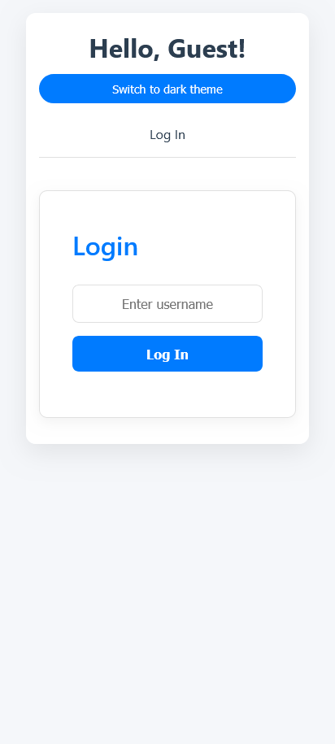
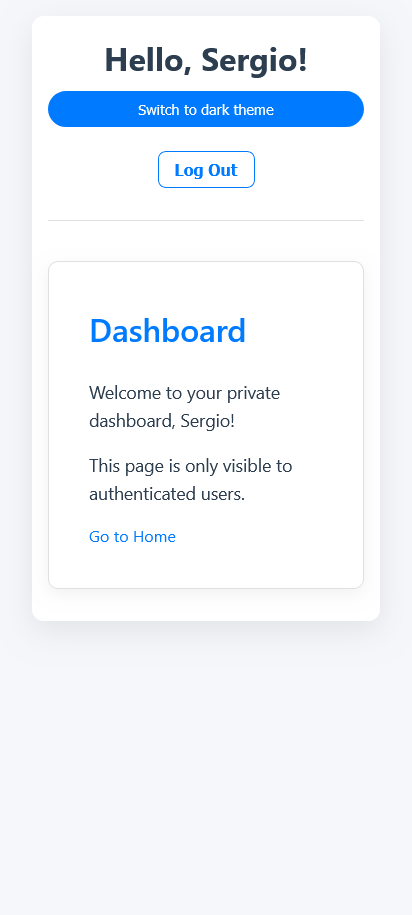
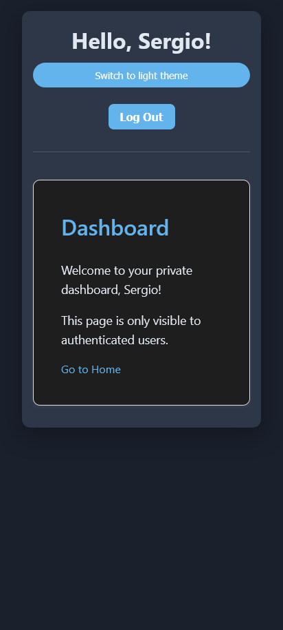
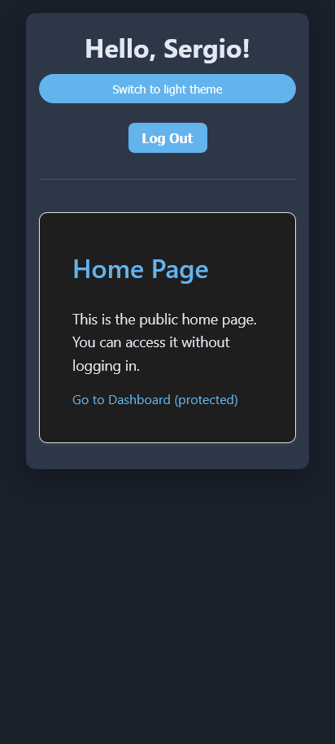

# Web App: Práctica con React

Este es un proyecto web creado para seguir refrescando mis habilidades en React. La aplicación fue diseñada para ser un ejemplo práctico de temas importantes de desarrollo frontend.

### Características clave

- **Manejo de Temas (Claro/Oscuro):** Implementado con el hook **`useContext`** para gestionar el estado global del tema, evitando el prop drilling y demostrando el uso eficiente de la API de contexto de React. El tema se persiste en el `localStorage` para recordar la preferencia del usuario.

- **Sistema de Autenticación de Usuario:** Se desarrolló un **custom hook** llamado `useAuth` que encapsula toda la lógica de login y logout. Este enfoque modular hace que la lógica de autenticación sea reutilizable y fácil de manejar en cualquier componente. El estado de autenticación también se persiste usando `localStorage`.

- **Rutas Protegidas:** Utilizando `React Router` y el estado de autenticación del hook `useAuth`, se implementaron rutas privadas que solo son accesibles si el usuario está logueado, lo cual demuestra un manejo sólido del enrutamiento y la seguridad en el frontend.

### Vistas de la Aplicación







### Tecnologías utilizadas

- **React:** La librería principal para la construcción de la interfaz de usuario.
- **TypeScript:** Usado para añadir tipado estático, lo que mejora la robustez y la legibilidad del código.
- **React Router:** Para gestionar la navegación y las rutas protegidas.
- **Vite:** Para la configuración del entorno de desarrollo.
- **CSS:** Para la estilización de los componentes y la implementación de un diseño responsivo.

### Cómo ejecutar el proyecto

Sigue estos pasos para tener una copia del proyecto en funcionamiento en tu máquina local.

1.  Clona el repositorio:
    ```bash
    git clone https://github.com/sergio2213/react-theme-auth-context.git
    ```
2.  Navega a la carpeta del proyecto:
    ```bash
    cd react-theme-auth-context
    ```
3.  Instala las dependencias:
    ```bash
    npm install
    ```
4.  Ejecuta la aplicación en modo de desarrollo:
    ```bash
    npm run dev
    ```
    La aplicación se abrirá en `http://localhost:5173`.
